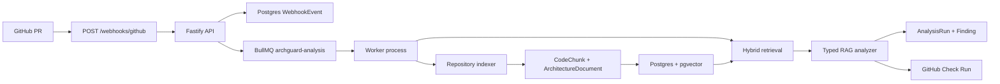

# ArchGuard

[](https://github.com/manishsoni-dev/ArchGuard/actions/workflows/ci.yml)

ArchGuard is an AI-powered GitHub PR bot that checks whether new code fits a repository's architecture.

## Problem

AI-generated code can compile, pass unit tests, and still damage a codebase. The common failure mode is not syntax. It is architectural drift: bypassed layers, inverted dependencies, ignored ADRs, and changes that do not match the conventions already present in the repository.

ArchGuard reviews pull requests against repository-specific architecture context instead of generic style rules. It is designed to answer a focused question:

> Does this PR fit how this codebase is supposed to be built?

## Why It Matters

Most automated review tools look for generic defects: lint issues, test failures, security patterns, or broad code smells. ArchGuard adds a different signal. It retrieves architecture decisions, source examples, and nearby code patterns, then posts a GitHub Check Run with a typed architecture verdict:

- `FIT`
- `DRIFT_RISK`
- `INSUFFICIENT_EVIDENCE`

The result is advisory in this local MVP, but the workflow is real: GitHub webhook to durable job to repository indexing to retrieval to analysis to Check Run.

## Core Features

- GitHub App webhook integration with signature verification.
- Pull request event routing for opened, reopened, and synchronize events.
- Durable webhook persistence with delivery-id idempotency.
- BullMQ and Redis worker pipeline for retryable PR analysis.
- Repository indexing for code and architecture documents.
- ADR ingestion from common `docs/adr` and architecture paths.
- pgvector-backed retrieval foundation for code and document chunks.
- Hybrid retrieval over changed files, ADRs, semantic search, and keyword fallback.
- Typed RAG analyzer with mock LLM mode by default.
- GitHub Check Run output with verdict, confidence, findings, evidence files, and advisory note.
- Local eval harness for architecture drift cases.
- Fixture repository verification for indexing, embeddings, retrieval, and analysis.
- Diagnostic commands for webhooks, queue state, analysis runs, ports, and GitHub App setup.

## Live Proof

This repository has been verified end-to-end as a real GitHub App against `manishsoni-dev/ArchGuard`, with a public Replit API and Vercel demo UI.

Live demo:

- Replit API: [https://arch-guard-1--manishsoni-dev.replit.app](https://arch-guard-1--manishsoni-dev.replit.app)
- Vercel UI: [https://demo-web-delta-five.vercel.app](https://demo-web-delta-five.vercel.app)
- Proof pack: [docs/live-demo-proof.md](docs/live-demo-proof.md)
- LinkedIn summary: [docs/linkedin-project-summary.md](docs/linkedin-project-summary.md)
- Portfolio card copy: [docs/portfolio-card.md](docs/portfolio-card.md)

GitHub Check Run proof:

- PR #8: `FIT`, merged after the live Replit and Vercel demo passed verification.
- PR #1: `DRIFT_RISK` for a frontend file importing the database layer directly.

Screenshots:

- [Replit API root](docs/screenshots/replit-api-root.png)
- [Vercel demo UI](docs/screenshots/vercel-demo-ui.png)
- [PR #8 FIT proof](docs/screenshots/pr-8-fit.png)
- [PR #1 DRIFT_RISK proof](docs/screenshots/pr-1-drift-risk.png)

## Architecture



See [docs/architecture.md](docs/architecture.md) for the deeper technical walkthrough.

## Hosted Deployment

ArchGuard can be deployed as two Node.js processes: an API server and a BullMQ worker, backed by Postgres with pgvector and Redis. The default hosted demo mode remains `ANALYZER_PROVIDER=rag`, `LLM_PROVIDER=mock`, and `EMBEDDING_PROVIDER=fake`, so no OpenAI key is required.

Deployment assets:

- [docs/deployment.md](docs/deployment.md)
- [docs/vercel-replit-live-demo.md](docs/vercel-replit-live-demo.md)
- [docs/live-demo-proof.md](docs/live-demo-proof.md)
- [docs/linkedin-project-summary.md](docs/linkedin-project-summary.md)
- [docs/portfolio-card.md](docs/portfolio-card.md)
- [docs/operations.md](docs/operations.md)
- [docs/railway-deployment.md](docs/railway-deployment.md)
- [deploy/README.md](deploy/README.md)
- [deploy/processes.md](deploy/processes.md)
- [deploy/docker-compose.production.example.yml](deploy/docker-compose.production.example.yml)
- [.env.production.example](.env.production.example)

Useful deployment checks:

Current public demo:

```bash
pnpm demo:check -- apiUrl=https://arch-guard-1--manishsoni-dev.replit.app -- webUrl=https://demo-web-delta-five.vercel.app
```

Do not run commands with literal placeholders such as `THE_REAL_API_SERVICE_URL`, `YOUR-STABLE-DOMAIN`, `YOUR-DEPLOYED-DOMAIN`, `YOUR-REPLIT-API-URL`, or `YOUR-VERCEL-URL`. Copy the exact public domain from the Railway API service, Replit, or Vercel.

```bash
pnpm deployment:checklist
pnpm production:command-check
pnpm railway:diagnose
pnpm railway:domain-check -- baseUrl=https://YOUR-DEPLOYED-DOMAIN
pnpm github-app:cutover-plan -- url=https://YOUR-STABLE-DOMAIN.com
pnpm validate:prod-env
pnpm smoke:deployment -- baseUrl=https://YOUR-DEPLOYED-DOMAIN
pnpm github:identity-check
pnpm hosted:pr-proof -- owner=manishsoni-dev repo=ArchGuard pr=NUMBER baseUrl=https://YOUR-DEPLOYED-DOMAIN
pnpm docker:build:api
pnpm docker:build:worker
```

Railway `404 Application not found` on `/health`, `/ready`, and `/version` means the domain is not attached to the API service, or the wrong/stale domain is being used. Fix it in Railway under API service → Networking → Generate/Attach Domain.

## Tech Stack

- TypeScript
- Node.js 22+
- Fastify
- Prisma ORM
- PostgreSQL with pgvector
- Redis
- BullMQ
- GitHub App API and Octokit
- Zod
- Vitest
- pnpm workspace

## Local Quickstart

Requirements:

- Node.js 22+
- pnpm
- Docker Desktop or compatible Docker runtime
- ngrok for real GitHub webhook testing

```bash
docker compose up -d postgres redis
pnpm install
pnpm prisma:generate
pnpm prisma:migrate
```

Run the API and worker in separate terminals:

```bash
pnpm dev
```

```bash
pnpm worker
```

Expose the local API for GitHub webhooks:

```bash
ngrok http 3000
```

Health checks:

```bash
curl http://localhost:3000/health
curl http://localhost:3000/ready
```

For ngrok free-tier browser warnings, terminal checks can include:

```bash
curl -H "ngrok-skip-browser-warning: true" https://YOUR-NGROK-DOMAIN.ngrok-free.dev/ready
```

## Verification Commands

Use the one-command local verification:

```bash
pnpm verify:local
```

Or run the gates individually:

```bash
pnpm test
pnpm typecheck
pnpm build
pnpm verify:phase3
ANALYZER_PROVIDER=rag LLM_PROVIDER=mock pnpm eval:rag
ANALYZER_PROVIDER=rag LLM_PROVIDER=mock pnpm e2e:check
pnpm exec prisma validate --schema prisma/schema.prisma
```

`verify:phase3` requires the local Postgres and Redis services. It proves fixture repository creation, ADR ingestion, indexing, fake embeddings, pgvector storage, retrieval checks, and analyzer fixture checks.

## Real GitHub PR Demo

1. Create a GitHub App.
2. Set the webhook URL to:

   ```text
   PUBLIC_WEBHOOK_URL + /webhooks/github
   ```

3. Configure minimum permissions:
   - Contents: Read-only
   - Pull requests: Read-only
   - Checks: Read and write
   - Metadata: Read-only
4. Subscribe to the `pull_request` event.
5. Install the app on the test repository.
6. Run the API, worker, Docker services, and ngrok.
7. Validate local readiness:

   ```bash
   ANALYZER_PROVIDER=rag LLM_PROVIDER=mock pnpm e2e:check
   ```

8. Create a PR that introduces an architecture violation, for example a frontend file importing from `backend/db`.
9. Inspect diagnostics:

   ```bash
   pnpm webhook:events
   pnpm queue:inspect
   pnpm analysis:runs
   ```

Expected result: GitHub shows a Check Run named `ArchGuard Architecture Fitness`. A violating frontend database import should produce `DRIFT_RISK`; normal maintenance changes should produce `FIT`.

For an interview-ready script, see [docs/demo-runbook.md](docs/demo-runbook.md).

## GitHub App Setup

Use the interactive helper instead of pasting private key text by hand:

```bash
pnpm setup:github-app:interactive
pnpm validate:github-app
```

The helper can discover downloaded `.pem` files, validate the private key, mask secret previews, back up `.env`, and update GitHub-related values safely.

## Environment Variables

Start from:

```bash
cp .env.example .env
```

Important groups:

- Local services: `PORT`, `DATABASE_URL`, `REDIS_URL`
- GitHub App: `GITHUB_APP_ID`, `GITHUB_PRIVATE_KEY`, `GITHUB_WEBHOOK_SECRET`, `GITHUB_CLIENT_ID`, `GITHUB_CLIENT_SECRET`
- Local webhook debug: `DEV_WEBHOOK_TOKEN`
- Retrieval: `EMBEDDING_PROVIDER`, `EMBEDDING_MODEL`, `EMBEDDING_DIMENSIONS`, `EMBEDDING_BATCH_SIZE`, `RETRIEVAL_TOP_K`, `RETRIEVAL_MAX_CONTEXT_CHARS`
- Analyzer: `ANALYZER_PROVIDER`, `LLM_PROVIDER`, `LLM_MODEL`, `RAG_PROMPT_VERSION`, `RAG_MAX_CONTEXT_CHARS`, `RAG_FALLBACK_TO_MOCK`
- GitHub demo: `PUBLIC_WEBHOOK_URL`, `TEST_GITHUB_OWNER`, `TEST_GITHUB_REPO`, optional `TEST_GITHUB_PR_NUMBER`, optional `TEST_GITHUB_INSTALLATION_ID`

Never commit `.env`, `.env.*`, downloaded GitHub App PEM files, ngrok tokens, OpenAI keys, webhook secrets, or client secrets.

## Current Limitations

- Mock LLM mode is the default and is the supported normal demo path.
- Fake deterministic embeddings are the default for local development.
- OpenAI LLM and embedding providers exist, but are opt-in and not required for CI or demos.
- The real GitHub demo currently uses local infrastructure plus ngrok.
- There is no SaaS dashboard yet.
- Tenant fields exist in the schema, but enterprise-grade tenant isolation is not implemented.

## Roadmap

Phase 7 candidates:

- Hosted deployment.
- Explicit real OpenAI smoke mode documentation and safeguards.
- Small web dashboard for runs and findings.
- Repository onboarding UI.
- Improved retrieval evals and golden evidence expectations.
- Better observability for worker latency and GitHub API failures.

## Security

See [docs/security.md](docs/security.md).

The short version:

- Keep GitHub App permissions minimal.
- Never commit secrets or PEM files.
- Do not log prompts, private keys, webhook secrets, client secrets, or raw full diffs.
- Rotate any secret that appears in terminal logs, screenshots, issue comments, or commits.
