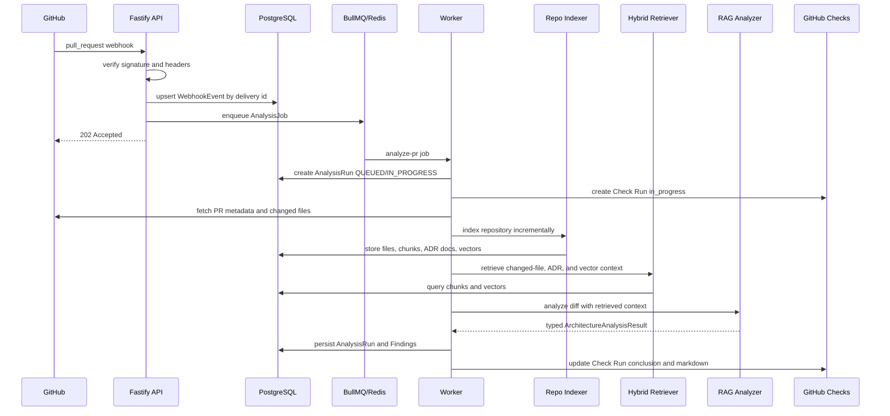

# ArchGuard Architecture

ArchGuard is a GitHub App that evaluates pull requests for architecture fitness. It checks whether a PR respects repository-specific conventions, ADRs, module boundaries, and dependency direction.

This document describes the current local MVP architecture.

## System Overview

ArchGuard has two runtime processes:

- API server: receives GitHub webhooks, verifies signatures, persists accepted events, and enqueues analysis jobs.
- Worker: processes queued PR analysis jobs, indexes repository context, retrieves architecture evidence, runs the selected analyzer, persists results, and updates GitHub Check Runs.

Supporting infrastructure:

- PostgreSQL stores tenants, repositories, PRs, webhook events, indexed files, chunks, architecture documents, analysis runs, and findings.
- pgvector stores embeddings for code and architecture chunks.
- Redis backs BullMQ durable job processing.

## Bounded Contexts

### GitHub Integration

Owns webhook verification, GitHub App authentication, PR metadata fetching, changed file fetching, and Check Run creation/update.

### Webhook Ingestion

Owns raw webhook intake, header validation, delivery-id idempotency, event classification, and durable event persistence.

### Analysis Workflow

Owns job payload validation, AnalysisRun lifecycle, retry behavior, failure classification, and Check Run finalization.

### Indexing and Retrieval

Owns repository cloning/pulling, file scanning, ADR parsing, chunk creation, fake/OpenAI embedding providers, pgvector storage, and hybrid retrieval.

### Analyzer

Owns analyzer provider selection, RAG prompt construction, context compression, strict result parsing, fallback behavior, and typed architecture verdicts.

## API Server

The Fastify API exposes:

- `GET /health`: process liveness.
- `GET /ready`: database, Redis, environment, and GitHub App readiness.
- `POST /webhooks/github`: real GitHub webhook endpoint.
- `POST /dev/github-webhook-debug`: development-only replay endpoint protected by `DEV_WEBHOOK_TOKEN`.

The API server does not execute analysis inline. It returns quickly after persistence and enqueueing.

## Webhook Ingestion

`POST /webhooks/github`:

1. Reads the raw request body.
2. Verifies `x-hub-signature-256`.
3. Validates required GitHub headers:
   - `x-github-event`
   - `x-github-delivery`
   - `x-hub-signature-256`
4. Persists the webhook event.
5. Uses `x-github-delivery` as an idempotency key.
6. Ignores unsupported events safely.
7. Enqueues an analysis job for supported PR actions:
   - `opened`
   - `reopened`
   - `synchronize`

Unsupported events are stored as `IGNORED` so local debugging can distinguish "not received" from "received but not actionable."

## Idempotency

GitHub may redeliver webhook events. ArchGuard stores every accepted delivery by unique `githubDeliveryId`.

If the same delivery arrives again:

- No duplicate BullMQ job is created.
- The API returns `202`.
- The persisted event remains the source of truth.

## Durable Queue

BullMQ queue name:

```text
archguard-analysis
```

Jobs use a typed payload:

```ts
type AnalysisJobPayload = {
  tenantId: string;
  repositoryId: string;
  owner: string;
  repo: string;
  installationId: number;
  pullRequestNumber: number;
  headSha: string;
  webhookEventId: string;
};
```

The worker validates payloads with Zod before processing. Retry policy uses three attempts with exponential backoff. Completed and failed jobs are retained in bounded history for diagnostics.

## Worker Lifecycle

For each accepted PR analysis job, the worker:

1. Validates job payload.
2. Creates or reuses one active `AnalysisRun` for repository, PR number, and head SHA.
3. Creates a GitHub Check Run with status `in_progress`.
4. Fetches PR metadata and changed files.
5. Indexes repository content incrementally.
6. Generates embeddings for pending chunks.
7. Retrieves architecture context.
8. Runs the selected analyzer.
9. Persists verdict, summary, confidence, findings, analyzer metadata, latency, and fallback status.
10. Updates the GitHub Check Run.
11. Marks the run `COMPLETED` or `FAILED`.

## Repository Indexing

The indexer clones or pulls repository content into a local cache, scans source and documentation files, chunks content, and stores chunk records in PostgreSQL.

Ignored content includes:

- `node_modules`
- `.git`
- `dist`
- `build`
- `coverage`
- lock files

Indexing is incremental:

- Unchanged files are skipped.
- Changed files have chunks rebuilt.
- Deleted files have stale indexed data removed.
- Unchanged chunks are not re-embedded.

## ADR Ingestion

ArchGuard detects Markdown architecture documents in common locations:

- `docs/adr`
- `docs/adrs`
- `adr`
- `adrs`
- `architecture`
- `docs/architecture`

The ADR parser extracts:

- title
- status
- date
- context
- decision
- consequences
- alternatives
- related notes

ADR chunks are stored as `chunkType = ADR` so retrieval can prioritize architecture-policy context.

## Hybrid Retrieval

Retrieval combines:

- changed-file chunks
- ADR and architecture-document chunks
- pgvector similarity search
- file-path keyword matching
- keyword fallback when vector retrieval is unavailable

The ranking policy treats query intent differently:

- Architecture-policy queries boost ADRs.
- Code-intent queries boost relevant source paths and symbols.
- Database repository queries boost backend DB paths.
- Service queries boost backend services.
- Frontend/component queries boost frontend and UI paths.

## RAG Analyzer

The RAG analyzer is selected with:

```env
ANALYZER_PROVIDER=rag
LLM_PROVIDER=mock
```

Mock LLM mode is deterministic and is the default demo path. OpenAI provider code exists, but real OpenAI calls are opt-in and not required for CI or local demos.

The analyzer returns a strict typed result:

```ts
type ArchitectureAnalysisResult = {
  verdict: "FIT" | "DRIFT_RISK" | "INSUFFICIENT_EVIDENCE";
  confidence: number;
  summary: string;
  findings: ArchitectureFinding[];
  retrievedContextSummary: string;
};
```

Invalid LLM output is repaired once. If repair fails, the analyzer returns `INSUFFICIENT_EVIDENCE` rather than crashing the worker.

## GitHub Check Run Output

Check Run output includes:

- verdict
- confidence
- analyzer provider
- model name
- fallback used
- retrieved context summary
- findings table
- top evidence files
- advisory note

It does not include full prompts, full retrieved context, private keys, tokens, webhook secrets, or raw full diffs.

## Persistence Model

Important tables:

- `Tenant`
- `Repository`
- `PullRequest`
- `WebhookEvent`
- `IndexedFile`
- `CodeChunk`
- `ArchitectureDocument`
- `AnalysisRun`
- `Finding`

Tenancy is intentionally simple in the MVP. Records carry `tenantId`, but hardened SaaS isolation is future work.

## Failure Handling

Expected failure behavior:

- Invalid webhook signature: return `401`, persist nothing.
- Unsupported webhook event: persist as `IGNORED`, return `202`.
- Duplicate delivery: return `202`, do not enqueue duplicate job.
- Invalid job payload: fail fast.
- Transient GitHub/API/network errors: BullMQ retry.
- Indexing failure: mark `AnalysisRun` as `FAILED`.
- Partial embedding failure: degrade retrieval if enough context remains.
- Retrieval failure: return `INSUFFICIENT_EVIDENCE` unless the database itself is unavailable.
- Analyzer failure with fallback enabled: fall back to mock analyzer and mark fallback metadata.

## Security Boundaries

- GitHub webhook signatures are verified before event handling.
- GitHub App authentication uses private-key app auth and installation tokens.
- API webhook endpoint does not execute commands.
- Development webhook replay is disabled in production and requires `DEV_WEBHOOK_TOKEN`.
- Secrets and private keys must never be logged.
- Minimum GitHub App permissions are used.

## Sequence Diagram


