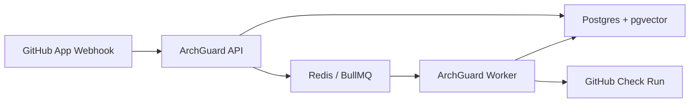

# Deployment

This guide prepares ArchGuard for a stable hosted demo while keeping the normal demo path on mock RAG and fake embeddings.

## Topology

ArchGuard runs as four services:

- API: Fastify server that receives GitHub webhooks and exposes health/readiness endpoints.
- Worker: BullMQ processor that indexes repositories, retrieves context, runs analysis, and updates GitHub Check Runs.
- Postgres with pgvector: persistence for webhook events, repositories, chunks, embeddings, analysis runs, and findings.
- Redis: BullMQ queue backend.

For the public portfolio/demo split where Vercel hosts the static UI and Replit runs the API plus worker, see [Vercel + Replit Live Demo](vercel-replit-live-demo.md). Do not deploy the API/worker runtime to Vercel.



## Required Environment Variables

Start from `.env.production.example`.

Required for production:

- `NODE_ENV=production`
- `DATABASE_URL`
- `REDIS_URL`
- `GITHUB_APP_ID`
- `GITHUB_PRIVATE_KEY`
- `GITHUB_WEBHOOK_SECRET`
- `GITHUB_CLIENT_ID`
- `GITHUB_CLIENT_SECRET`
- `PUBLIC_WEBHOOK_URL`
- `ANALYZER_PROVIDER`
- `LLM_PROVIDER`
- `EMBEDDING_PROVIDER`

Recommended hosted demo mode:

```text
ANALYZER_PROVIDER=rag
LLM_PROVIDER=mock
EMBEDDING_PROVIDER=fake
```

OpenAI is opt-in. If either `LLM_PROVIDER=openai` or `EMBEDDING_PROVIDER=openai`, set `OPENAI_API_KEY`.

Validate before deployment:

```bash
pnpm validate:prod-env
pnpm deployment:checklist
```

## Build and Run

Build images:

```bash
pnpm docker:build:api
pnpm docker:build:worker
```

Run migrations:

```bash
pnpm prisma migrate deploy --schema prisma/schema.prisma
```

Start processes:

```bash
node apps/api/dist/src/server.js
node apps/api/dist/src/jobs/worker.js
```

Or adapt `deploy/docker-compose.production.example.yml` for your host.

## GitHub App Webhook

In GitHub App settings:

1. Open the app settings page.
2. Set the webhook URL to:

   ```text
   PUBLIC_WEBHOOK_URL + /webhooks/github
   ```

3. Keep the webhook secret in sync with `GITHUB_WEBHOOK_SECRET`.
4. Confirm permissions:
   - Contents: Read-only
   - Pull requests: Read-only
   - Checks: Read and write
   - Metadata: Read-only
5. Subscribe to the Pull request event.
6. Install the app on the test repository.

Generate the cutover plan for a stable domain:

```bash
pnpm github-app:cutover-plan -- url=https://YOUR-STABLE-DOMAIN.com
```

## Production Readiness Checklist

- API container starts successfully.
- Worker container starts successfully.
- Postgres is reachable and migrations are applied.
- `CREATE EXTENSION vector` migration has run.
- Redis is reachable.
- `GET /health` returns 200.
- `GET /ready` returns 200.
- `pnpm validate:prod-env` returns `status: ok`.
- `pnpm smoke:deployment -- baseUrl=https://YOUR-DOMAIN` returns `status: ok`.
- GitHub App webhook URL points at the stable HTTPS domain.
- The app is installed on the intended repository.
- A test PR receives an `ArchGuard Architecture Fitness` Check Run.

## Smoke Test

```bash
pnpm smoke:deployment -- baseUrl=https://YOUR-DOMAIN
```

The smoke test checks:

- `/health`
- `/ready`
- HTTPS URL shape
- `/webhooks/github` URL shape
- `/version` when available

It does not require GitHub to deliver a webhook.

## Real PR Verification Flow

1. Create a branch in the installed repository.
2. Make a small source change.
3. Open a PR.
4. Confirm GitHub webhook delivery returns 202.
5. Confirm the worker logs a completed analysis job.
6. Confirm an `AnalysisRun` row exists.
7. Confirm the PR shows `ArchGuard Architecture Fitness`.

Useful diagnostics:

```bash
pnpm webhook:events
pnpm queue:inspect
pnpm analysis:runs
pnpm demo:check -- apiUrl=https://YOUR-DOMAIN
pnpm github:identity-check
pnpm hosted:pr-proof -- owner=manishsoni-dev repo=ArchGuard pr=NUMBER baseUrl=https://YOUR-DOMAIN
```

## Rollback Strategy

1. Revert the application image to the previous known-good tag.
2. Keep Postgres data intact.
3. Do not roll back migrations unless a migration is explicitly marked reversible and tested.
4. Restart API and worker.
5. Run the deployment smoke test.
6. Redeliver a GitHub webhook or push a no-op PR commit to verify Check Run creation.

## Common Failures

### Webhook 401

- `GITHUB_WEBHOOK_SECRET` does not match the GitHub App webhook secret.
- GitHub is sending to an old deployment.

### Webhook 404

- GitHub App webhook URL does not end in `/webhooks/github`.
- The API process is not serving the expected route.

### No Worker Running

- Queue receives jobs but no `AnalysisRun` completes.
- Start the worker process and check `REDIS_URL`.

### Redis Unavailable

- `/ready` returns degraded or error.
- Worker cannot reserve jobs.
- Confirm Redis host, port, network, and credentials.

### pgvector Missing

- Phase 3 verification or retrieval fails.
- Run migrations and confirm the `vector` extension exists.

### GitHub Check Run Not Created

- Checks permission is missing or not accepted after a permissions update.
- App is not installed on the repository.
- Worker logs should show the GitHub API failure.

### Wrong PUBLIC_WEBHOOK_URL

- GitHub sends events to an old domain.
- Update GitHub App settings and rerun `pnpm validate:prod-env`.

### Wrong Installation Repository

- Webhooks arrive for a repository different from the intended demo repo.
- Reinstall or update repository access for the GitHub App.
