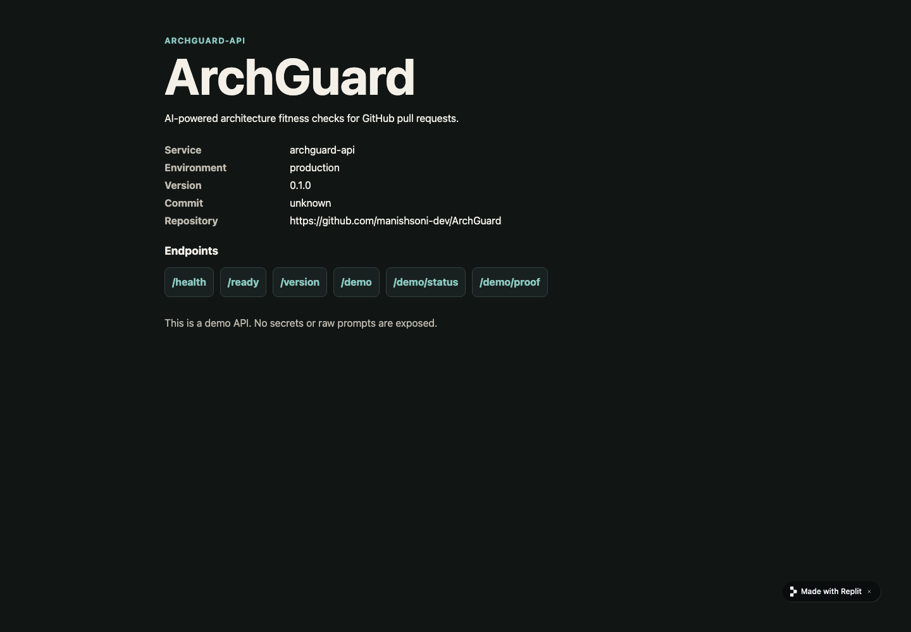
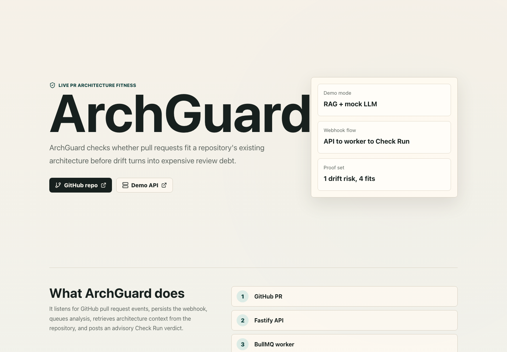
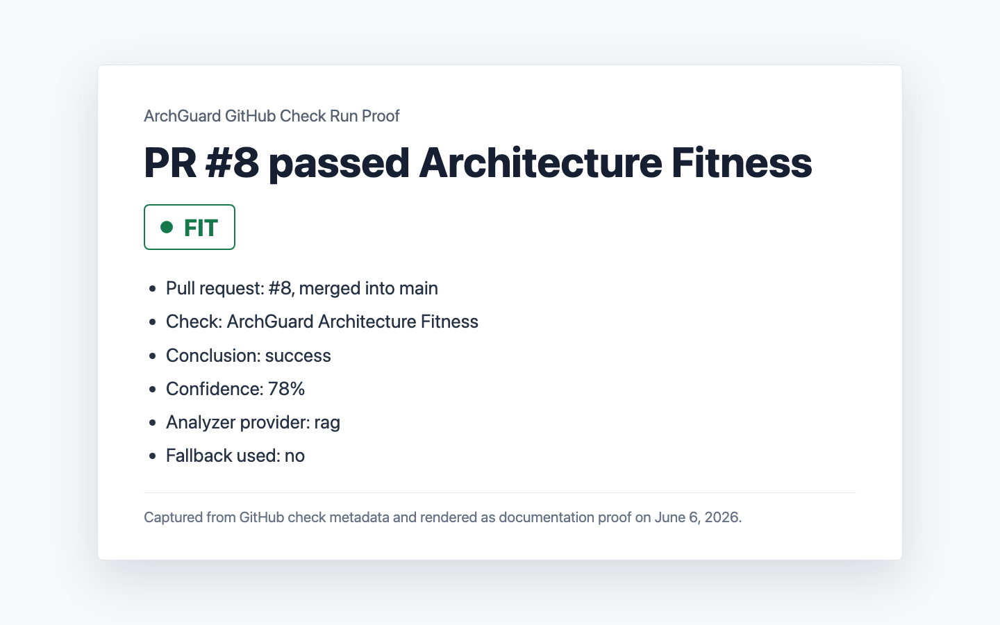
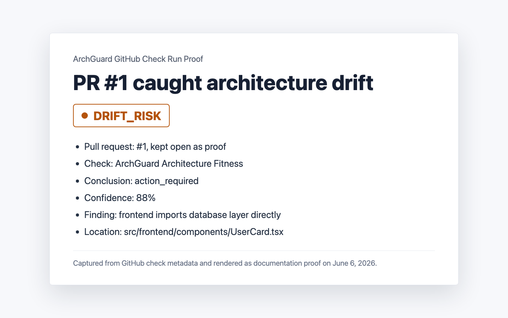

# Live Demo Proof

Last verified: June 6, 2026

This proof pack records the public ArchGuard demo endpoints, the passing live demo check, and GitHub Check Run proof for both a passing PR and a drift-risk PR.

## Live URLs

- Replit API: [https://arch-guard-1--manishsoni-dev.replit.app](https://arch-guard-1--manishsoni-dev.replit.app)
- Vercel UI: [https://demo-web-delta-five.vercel.app](https://demo-web-delta-five.vercel.app)
- Repository: [https://github.com/manishsoni-dev/ArchGuard](https://github.com/manishsoni-dev/ArchGuard)

## Demo Check

Command:

```bash
pnpm demo:check -- apiUrl=https://arch-guard-1--manishsoni-dev.replit.app -- webUrl=https://demo-web-delta-five.vercel.app
```

Result:

- Overall status: `ok`
- API `/health`: `ok`
- API `/ready`: `ok`
- API `/version`: `ok`
- API `/demo/status`: `ok`
- API `/demo/proof`: `ok`
- Web UI: `ok`

## Endpoint Proof

The Replit API exposes the public demo surface without exposing secrets, raw prompts, database URLs, Redis URLs, or retrieved context.

- `/`: public API landing page
- `/health`: service health
- `/ready`: Postgres, Redis, and GitHub App readiness
- `/version`: service version metadata
- `/demo/status`: public demo status
- `/demo/proof`: public proof metadata





## PR #8 FIT Proof

- Pull request: [PR #8](https://github.com/manishsoni-dev/ArchGuard/pull/8)
- State: `MERGED`
- Head SHA: `b5188cbc9e0b004effcc46678474b2fd1cead8d1`
- Check: `ArchGuard Architecture Fitness`
- Check title: `ArchGuard verdict: FIT`
- Conclusion: `success`
- Completed at: `2026-06-05T11:04:05Z`
- Verdict: `FIT`
- Confidence: `78%`
- Analyzer provider: `rag`
- Model: `gpt-4o-mini`
- Fallback used: `no`



## Previous DRIFT_RISK Proof

- Pull request: [PR #1](https://github.com/manishsoni-dev/ArchGuard/pull/1)
- State: `OPEN`
- Head SHA: `9a74593ed56ab63d5cc5a3443f8425271d8283fb`
- Check: `ArchGuard Architecture Fitness`
- Check title: `ArchGuard verdict: DRIFT_RISK`
- Conclusion: `action_required`
- Completed at: `2026-05-25T14:06:14Z`
- Verdict: `DRIFT_RISK`
- Confidence: `88%`
- Analyzer provider: `rag`
- Model: `gpt-4o-mini`
- Fallback used: `no`
- Finding: frontend imports database layer directly
- Location: `src/frontend/components/UserCard.tsx`


